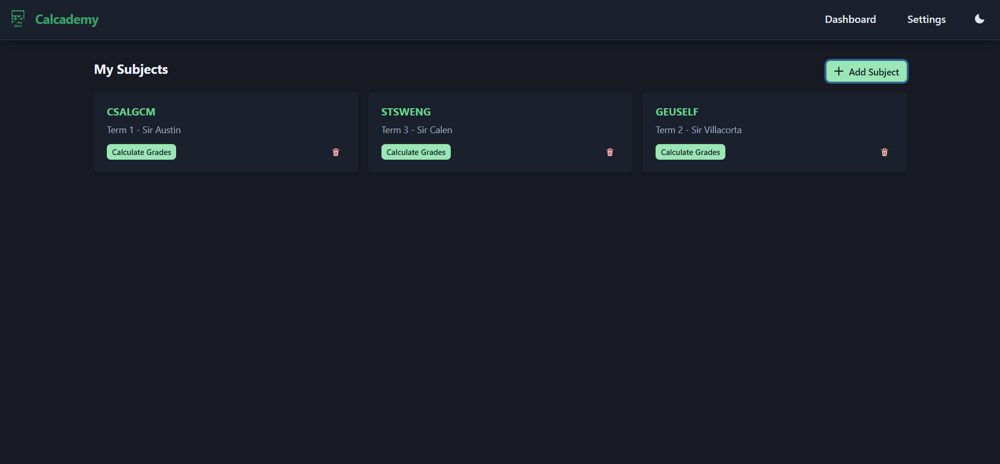
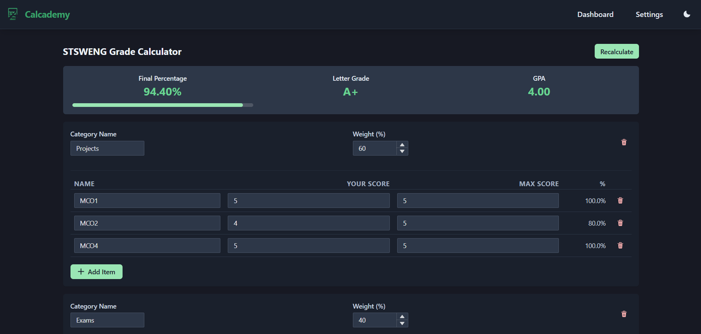

# Calcademy

Calcademy is a customizable, student-focused grade calculator built to help users better understand and manage their academic performance.

Site: [https://calcademy.vercel.app/](https://calcademy.vercel.app/)

  
  

---

## Motivation

I hated when I wanted to calculate the minimum score I needed on a final to pass but:
- **Some assignments are missing** or ungraded.
- **Exam grade holders are missing**.
- **Grade weights aren't applied** correctly or are not visible.
- **Bonus points** are given and not reflected in the final grade.

---
## Tech Used
- **React**
- **Chakra UI**

---
